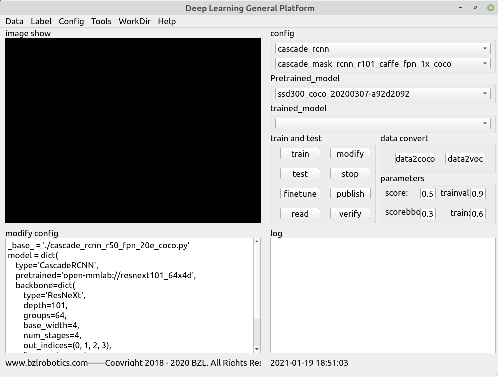
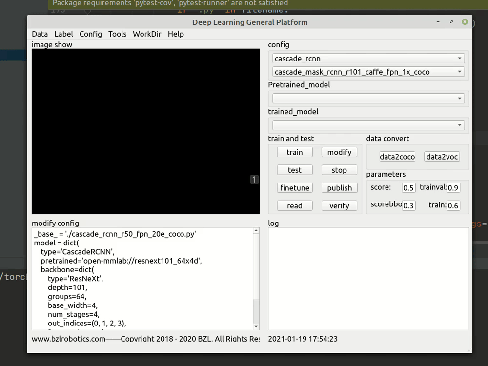

# MMDet-UI

## Introduction

Add a UI interface,created by PyQt5,convenient for beginners can quickly start, use the best deep learning algorithm to complete the task This warehouse is based on mmdet-2.1.0, PyTorch1.3-PyTorch1.6. For specific tutorials, please refer to the official tutorial

##Benchmark and model zoo
|                    | ResNet   | ResNeXt  | SENet    | VGG      | HRNet | RegNetX | Res2Net |
|--------------------|:--------:|:--------:|:--------:|:--------:|:-----:|:--------:|:-----:|
| RPN                | ✓        | ✓        | ☐        | ✗        | ✓     | ☐        | ☐     |
| Fast R-CNN         | ✓        | ✓        | ☐        | ✗        | ✓     | ☐        | ☐     |
| Faster R-CNN       | ✓        | ✓        | ☐        | ✗        | ✓     | ✓        | ✓     |
| Mask R-CNN         | ✓        | ✓        | ☐        | ✗        | ✓     | ✓        | ✓     |
| Cascade R-CNN      | ✓        | ✓        | ☐        | ✗        | ✓     | ☐        | ✓     |
| Cascade Mask R-CNN | ✓        | ✓        | ☐        | ✗        | ✓     | ☐        | ✓     |
| SSD                | ✗        | ✗        | ✗        | ✓        | ✗     | ✗        | ✗     |
| RetinaNet          | ✓        | ✓        | ☐        | ✗        | ✓     | ✓        | ☐     |
| GHM                | ✓        | ✓        | ☐        | ✗        | ✓     | ☐        | ☐     |
| Mask Scoring R-CNN | ✓        | ✓        | ☐        | ✗        | ✓     | ☐        | ☐     |
| Double-Head R-CNN  | ✓        | ✓        | ☐        | ✗        | ✓     | ☐        | ☐     |
| Grid R-CNN (Plus)  | ✓        | ✓        | ☐        | ✗        | ✓     | ☐        | ☐     |
| Hybrid Task Cascade| ✓        | ✓        | ☐        | ✗        | ✓     | ☐        | ✓     |
| Libra R-CNN        | ✓        | ✓        | ☐        | ✗        | ✓     | ☐        | ☐     |
| Guided Anchoring   | ✓        | ✓        | ☐        | ✗        | ✓     | ☐        | ☐     |
| FCOS               | ✓        | ✓        | ☐        | ✗        | ✓     | ☐        | ☐     |
| RepPoints          | ✓        | ✓        | ☐        | ✗        | ✓     | ☐        | ☐     |
| Foveabox           | ✓        | ✓        | ☐        | ✗        | ✓     | ☐        | ☐     |
| FreeAnchor         | ✓        | ✓        | ☐        | ✗        | ✓     | ☐        | ☐     |
| NAS-FPN            | ✓        | ✓        | ☐        | ✗        | ✓     | ☐        | ☐     |
| ATSS               | ✓        | ✓        | ☐        | ✗        | ✓     | ☐        | ☐     |
| FSAF               | ✓        | ✓        | ☐        | ✗        | ✓     | ☐        | ☐     |
| PAFPN              | ✓        | ✓        | ☐        | ✗        | ✓     | ☐        | ☐     |
| NAS-FCOS           | ✓        | ✓        | ☐        | ✗        | ✓     | ☐        | ☐     |
| PISA               | ✓        | ✓        | ☐        | ✗        | ✓     | ☐        | ☐     |
##Demo
